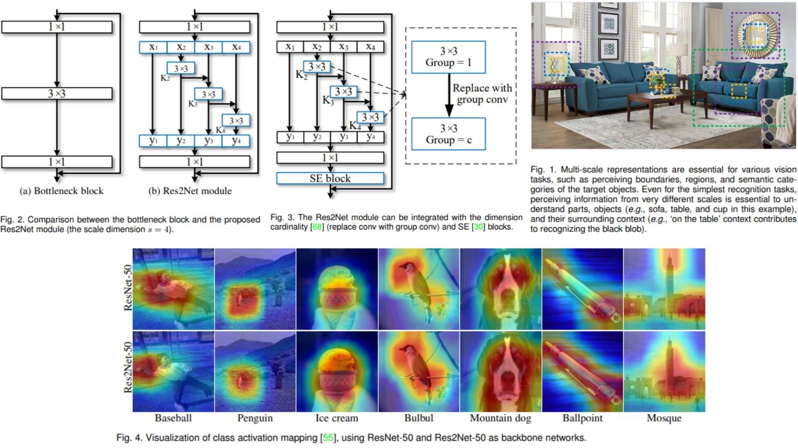
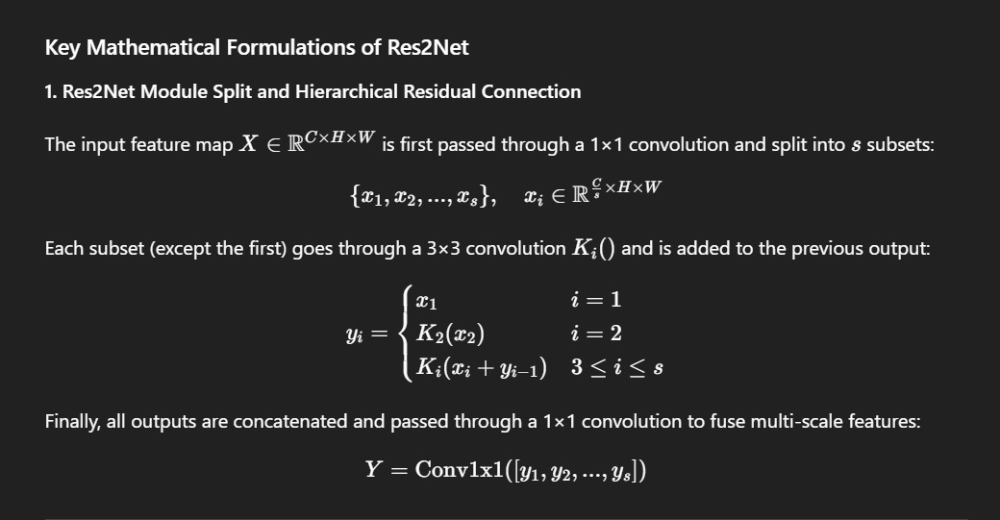

# 🌿 Res2Net PyTorch Implementation

This repository contains a PyTorch implementation of **Res2Net**, integrating the **Res2Net module** for **hierarchical multi-scale feature extraction** within residual networks. The model is designed to capture **both local and global features** efficiently while maintaining comparable computational cost.  

- Implemented **Res2Net** with **hierarchical residual-like connections** and optional **SE blocks**.  
- Architecture:  
**Stem → Res2NetResidualBlocks (+SE optional) → GlobalAvgPool → Flatten → FC**

> **Note on Res2Net module:** Each module splits input features into `s` subsets, applies **3×3 convolutions hierarchically**, and merges them via concatenation. This design allows the network to learn **multi-scale receptive fields** dynamically.

**Paper reference:** [Res2Net: A New Multi-scale Backbone Architecture](https://arxiv.org/abs/1904.01169) 🐢

---

## 🖼 Overview – Res2Net Architecture

  
*Figure 1:* Multi-scale representations are key for vision tasks, recognizing boundaries,
regions, object categories, and context ('on the table' helps identify objects).

*Figure 2:* (a) Bottleneck block: standard 1x1 + 3x3 conv residual block.
(b) Res2Net (s=4): splits feature maps, each subset (i>1) summed with previous output,
3x3 conv, then concatenated via 1x1 conv.

*Figure 3:* Res2Net integration:
- Cardinality: use group conv (groups = c)
- SE block: recalibrates channel-wise features before residual connection

*Figure 4:* Grad-CAM ResNet-50 vs Res2Net-50:
- Lighter = stronger activation
- Res2Net-50 better activates small objects (baseball, penguin)
- Covers whole large objects (bulbul, mountain dog, ballpoint, mosque)

---

## 🧮 Key Mathematical Idea

  
- Split input feature map $$X$$ into $$s$$ subsets: 
$$X = [x_1, x_2, \dots, x_s]$$  

- Process each subset recursively:  
  - $$y_1 = x_1$$  
  - $$y_2 = K_2(x_2)$$  
  - $$y_i = K_i(x_i + y_{i-1}), \quad i = 3, \dots, s$$  

- Concatenate outputs and optionally apply SE: 
$$Y = \text{concat}(y_1, \dots, y_s) \quad \rightarrow \quad SE(Y)$$


This hierarchical splitting enables **combinatorial expansion of receptive fields** within a single block.

---

## 🏗️ Model Architecture

```bash
Res2Net/
│
├── src/
│   ├── layers/
│   │   ├── conv_layer.py             # Standard 1x1 and 3x3 convolutions
│   │   ├── res2net_block.py          # Res2Net module (split + hierarchical residual connections)
│   │   ├── se_block.py               # Optional Squeeze-and-Excitation
│   │   ├── flatten_layer.py          # Flatten for classifier
│   │   ├── fc_layer.py               # Fully connected classifier
│   │   ├── pool_layers/
│   │   │   ├── maxpool_layer.py      # MaxPool
│   │   │   └── avgpool_layer.py      # Global/AdaptiveAvgPool for SE or feature fusion
│   │
│   ├── blocks/
│   │   ├── res2net_residual.py       # Residual block integrating Res2Net module
│   │   └── bottleneck_block.py       # Optional baseline bottleneck
│   │
│   ├── model/
│   │   └── res2net_model.py          # Full Res2Net: Stem + Res2NetResidualBlocks + SE + Classifier
│   │
│   └── config.py                      # Input size, num_classes, depth, scale s, cardinality c, SE reduction ratio
│
├── images/
│   ├── table1.jpg                     # Top-1/Top-5 accuracy and parameters
│   ├── figures.jpg                    # Figures 1-4 from the paper
│   └── math.jpg                       # Key Res2Net equations and hierarchical splits
│
├── requirements.txt
└── README.md
```
---


## 🔗 Feedback

For questions or feedback, contact: [barkin.adiguzel@gmail.com](mailto:barkin.adiguzel@gmail.com)
